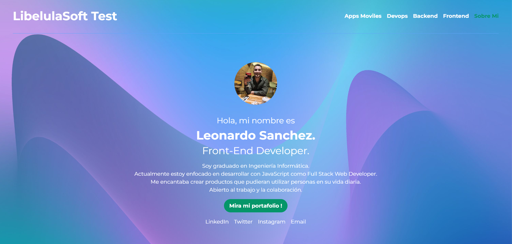
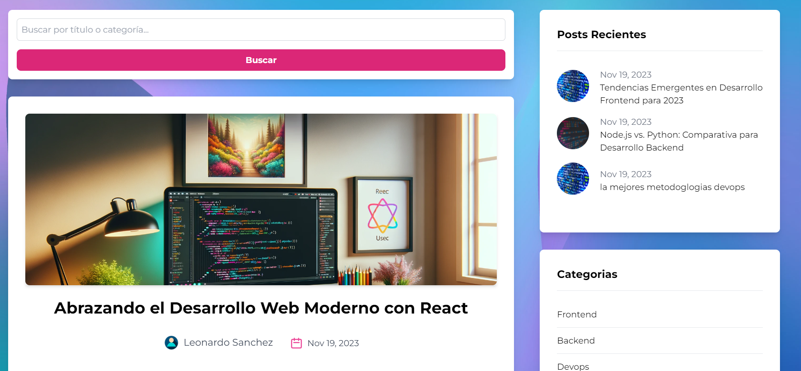
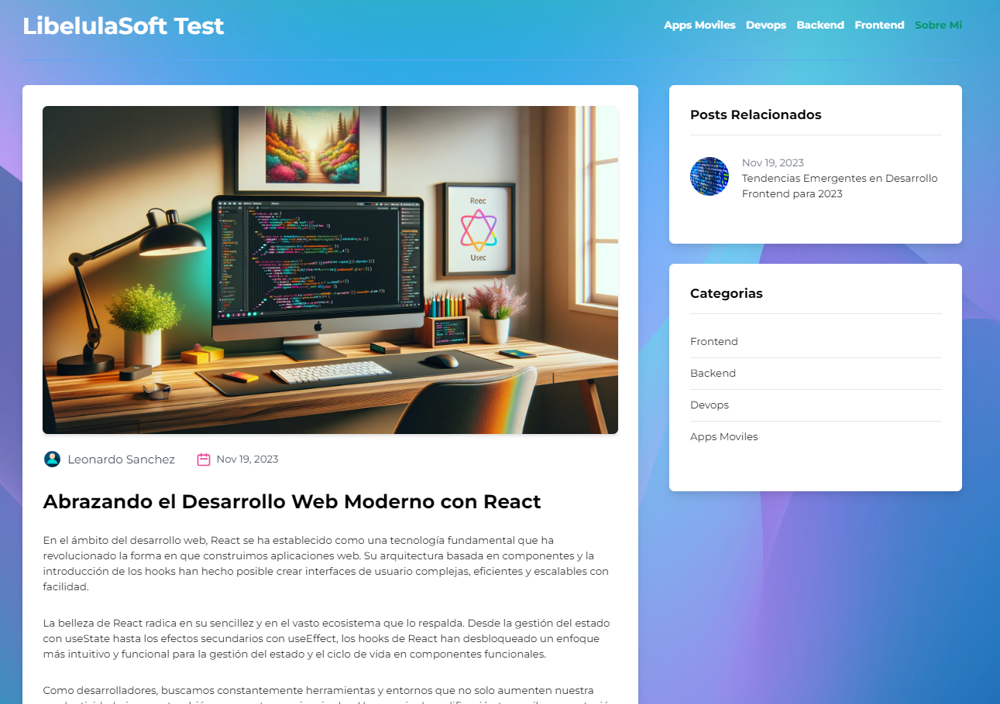
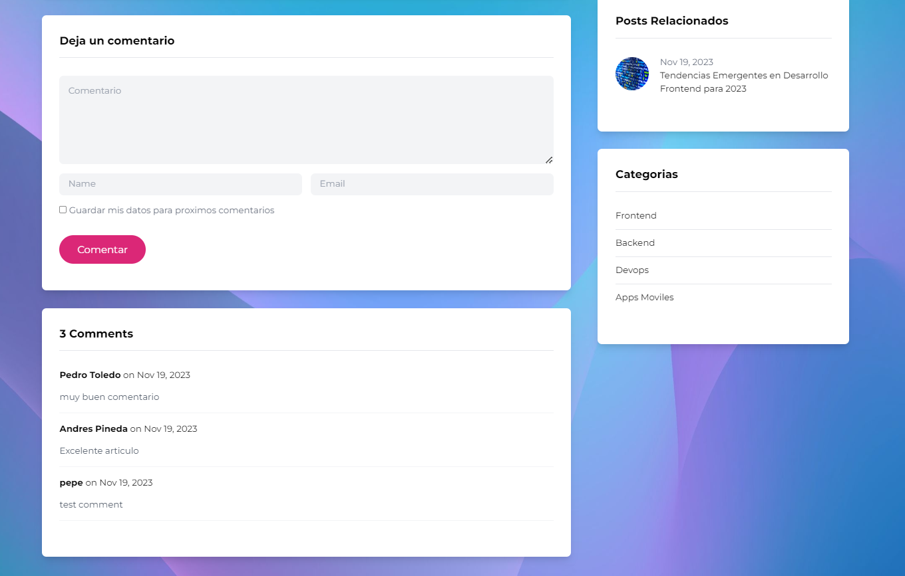
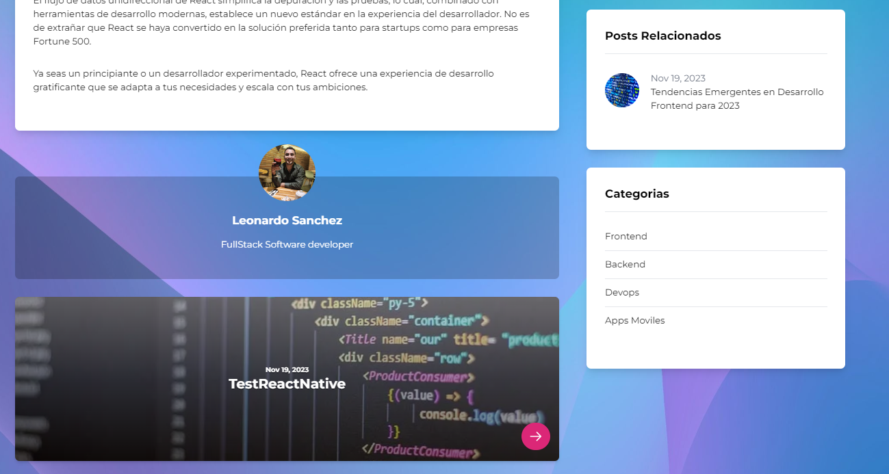
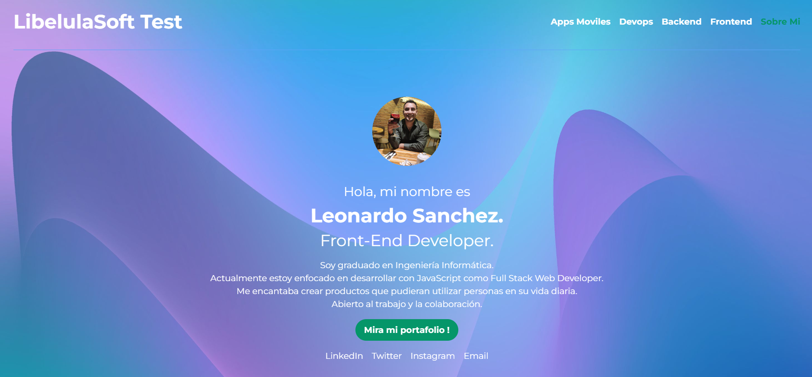
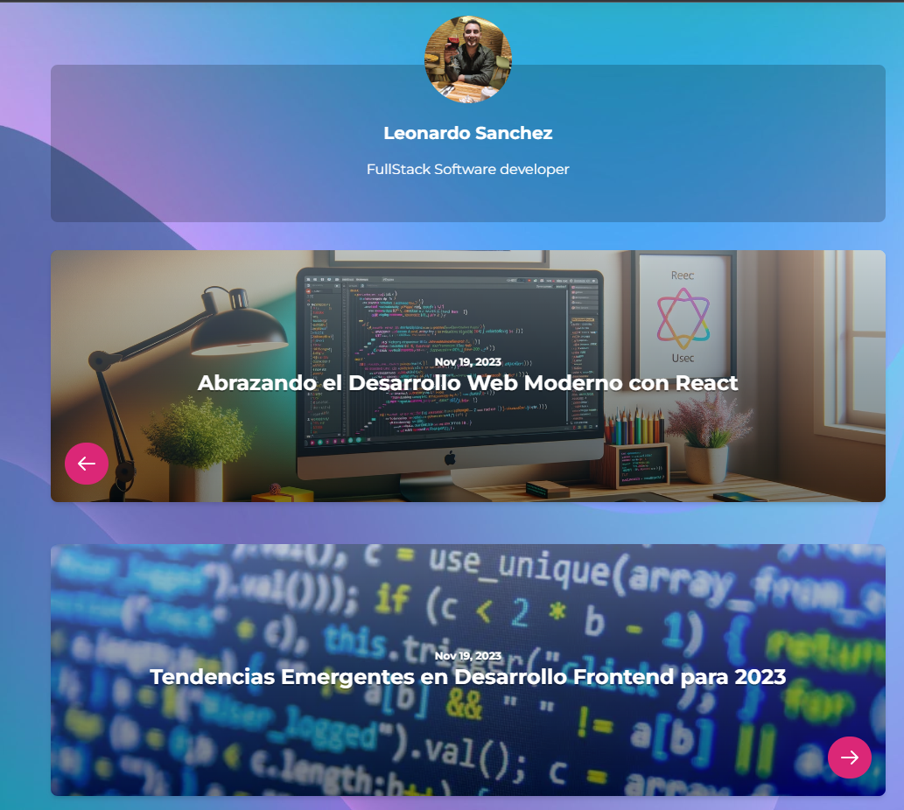

# LibelulaSoft Test

Blog Creado con next.js , Graph QL, Tailwind consta de frontend y backend utilizando GraphCMS un gestor de contenido en el backend el cual funciona de manera independiente 

- Para corre el poryecto en local se deben corrr los  siguientes comandos 

		   npm install
		   npm run dev 
-  Es necesario mantener las mismas credenciales del .env ya que esta posee la coneccion al CMS desde donde se consume el contenido generado  
- se necesita minimo Node v16.0 LTS para correr el proyecto 

## capturas 

# Temas a considerar

-   Los comentarios tiene una capa de moderador lo que indica que una ves enviados los comentarios deben ser aprobados para su publicacion accioen que se realiza mediante el CMS
   
-   en la pagina de sobr emi los botones de redes sociales no redirigen a ninuna red ya que el poryecto es demostrativo sin envargo  consta de un boton que redirecciona a mi pagina personal 

- los pos relacionados son post que se encuentran en la misma categoria alguans categorias solo cuentan con un post
    
-   Puedes navegar entre el post anterior y el siguiente haciendo clicl en las flechas debajo del autor

